---

    <picture>
        <source media="(prefers-color-scheme: dark)" srcset="img/logo DomuNet bianco senza sfondo.png" />
        <source media="(prefers-color-scheme: light)" srcset="img/logo DomuNet nero senza sfondo.png" />
    </picture>

DomuNet è sia un'applicazione (fittizia) per controllare i dispositivi che un social network, pensato per rivoluzionare il concetto di domotica e portarlo nelle case di tutti.

Una descrizione più dettagliata può esser vista dalla [documentazione](Documentazione%20DomuNet.pdf).

Al seguente [link](https://www.figma.com/proto/ldc2GuWpKz8XZmTlJyJN4l/Scrollable?node-id=0-1&t=I9wbSZtho2EysW42-1) è possibile navigare una demo realizzata su Figma.

---

# Screenshots:
Di seguito riporto degli screenshot esemplificativi dei mockup.

## Overview:
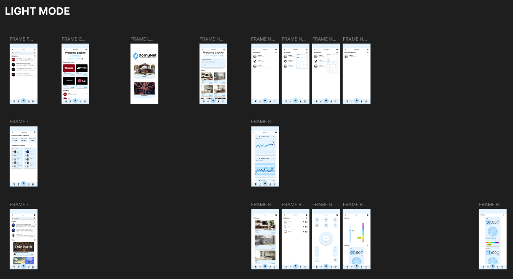

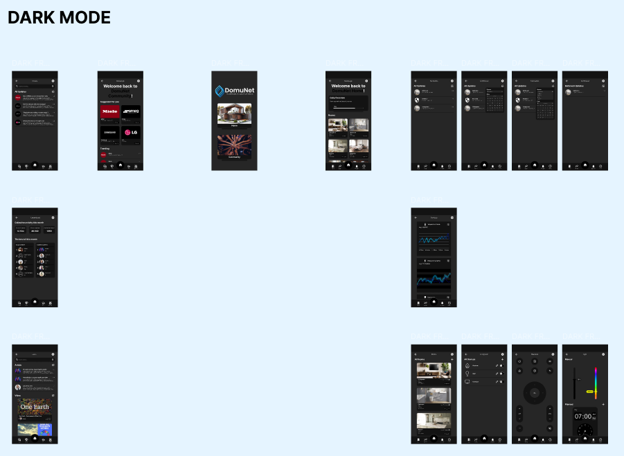

## DomuNet Home:
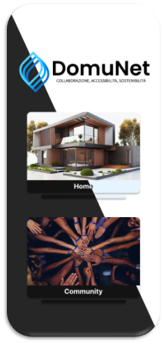

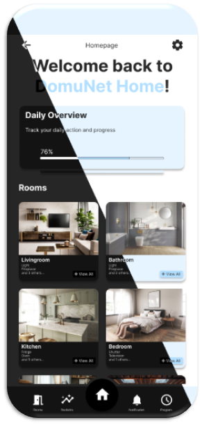

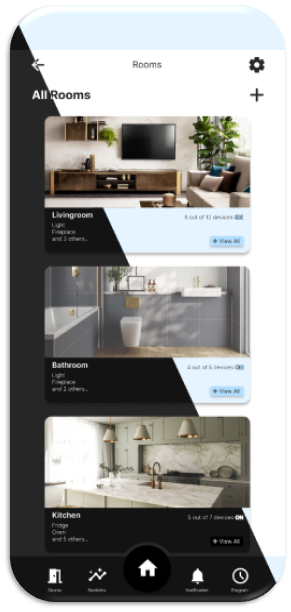

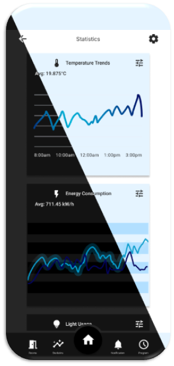

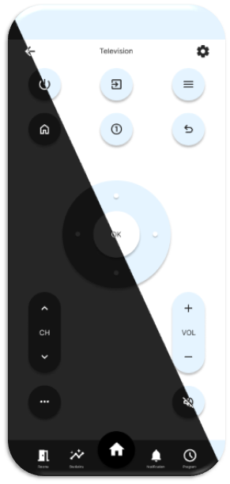

## DomuNet Community:
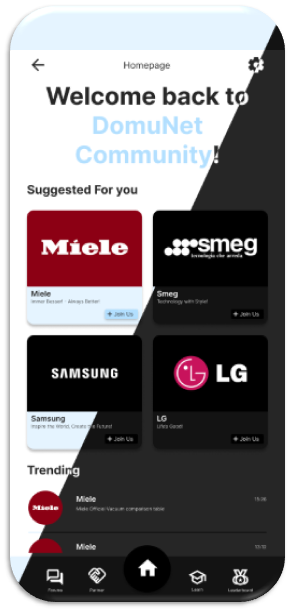

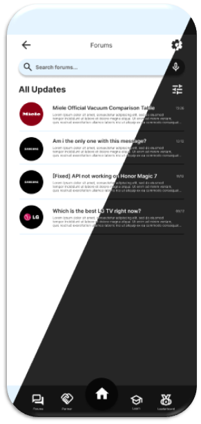

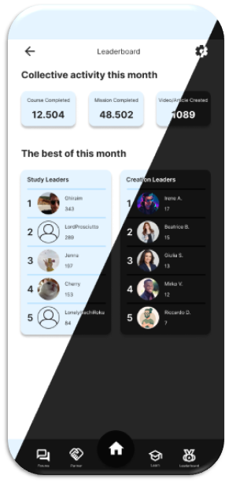

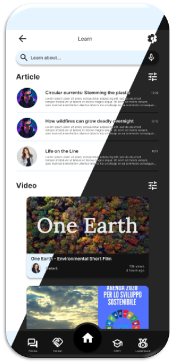

---