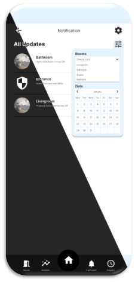

---

    <picture>
        <source media="(prefers-color-scheme: dark)" srcset="https://github.com/JoJoJoJonny/figma-mockup-university-project/blob/main/img/logo%20DomuNet%20bianco%20senza%20sfondo.png" />
        <source media="(prefers-color-scheme: light)" srcset="https://github.com/JoJoJoJonny/figma-mockup-university-project/blob/main/img/logo%20DomuNet%20nero%20senza%20sfondo.png" />
        
    </picture>

DomuNet è sia un'applicazione (fittizia) per controllare i dispositivi che un social network, pensato per rivoluzionare il concetto di domotica e portarlo nelle case di tutti.

Una descrizione più dettagliata può esser vista dalla [documentazione](Documentazione%20DomuNet.pdf).

Al seguente [link](https://www.figma.com/proto/ldc2GuWpKz8XZmTlJyJN4l/Scrollable?node-id=0-1&t=I9wbSZtho2EysW42-1) è possibile navigare una demo realizzata su Figma.

---

# Screenshots:
Di seguito riporto degli screenshot esemplificativi dei mockup.

## Overview:

<svg fill="none" viewBox="0 0 600 300" width="600" height="300" xmlns="http://www.w3.org/2000/svg">
  <foreignObject width="100%" height="100%">
    

      

      

        <h1>Hi there, my name is Nikola 👋</h1>
      

    

  </foreignObject>
</svg>

<svg fill="none" viewBox="0 0 600 300" width="600" height="300" xmlns="http://www.w3.org/2000/svg">
    <foreignObject width="100%" height="100%">
        

            

            

                <h1>Hi there, my name is Nikola 👋</h1>
            

        

    </foreignObject>

    

    <h2> DomuNet Home: </h2>

    <table>
        <tr>
            <td>
                
            </td>
            <td>
                
            </td>
        </tr>
        <tr>
            <td>
                
            </td>
            <td>
                
            </td>
        </tr>
        <tr>
            <td>
                
            </td>
            <td>
                
            </td>
        </tr>
    </table>

</svg>

|||
|-----|-----|
|||
|||

## DomuNet Community:
|||
|-----|-----|
|||

---